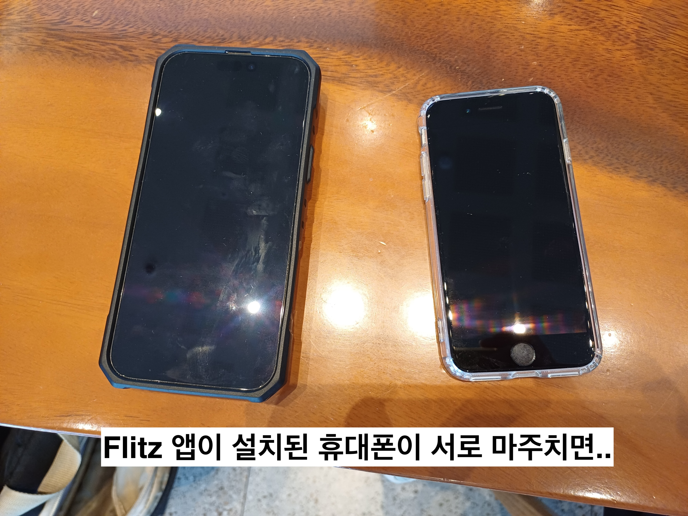
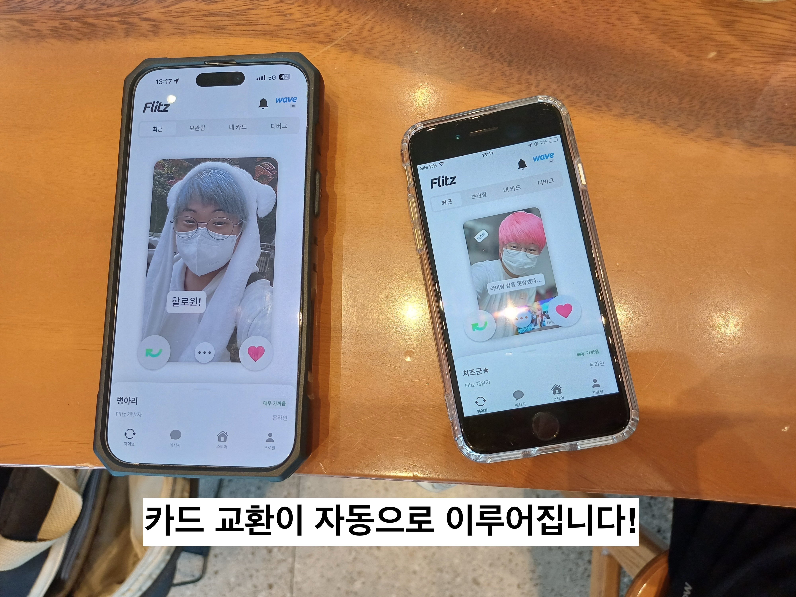
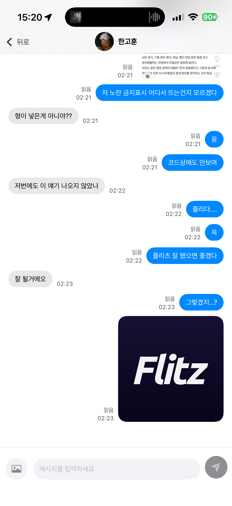
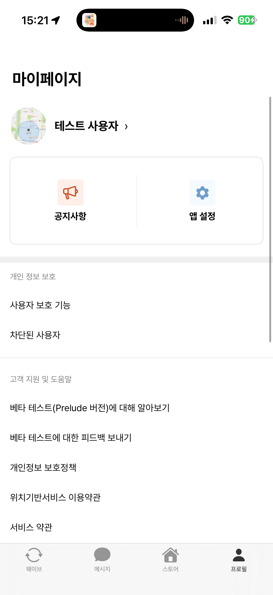
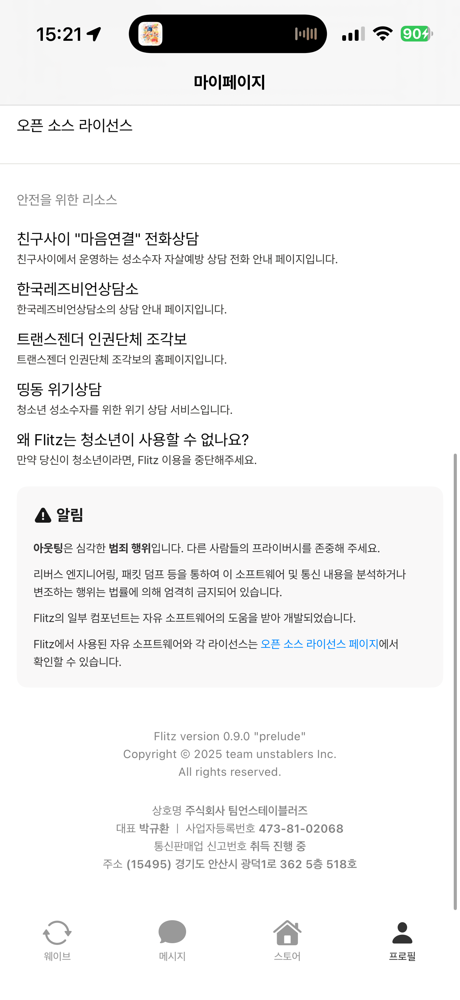
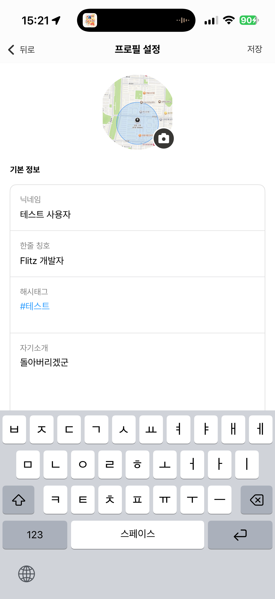
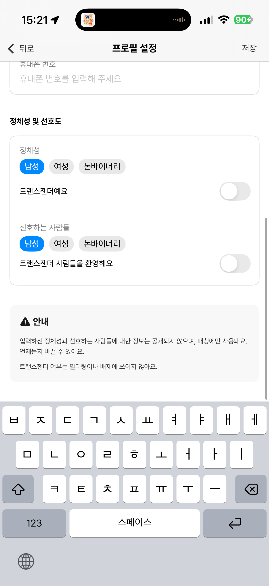

# REST IN PEACE

> **Flitz.app**
>
> *2025-09-07 ~ 2025-12-03*
> 
> *홍보 예산 부족으로 인한 사용자 확보 실패*

## 왜 중단했나요?

- 홍보/마케팅에 쓸 예산이 거의 없었고
- 동시에 생계용 SI 일감과 부채 문제를 처리하느라
- 혼자서 감당할 수 있는 에너지와 시간이 완전히 바닥났습니다.

아이디어가 싫어져서가 아니라, 현실적인 이유로 "여기까지" 하게 되었습니다.

## 이 소스코드는 어떻게 쓸 수 있나요?

- Flitz의 모든 소스 코드는 **Artistic License 2.0 라이선스** 하에 공개됩니다.
- 마음에 들면 가져가서, 뜯어고치거나 새 프로젝트의 참고용으로 마음껏 써 주세요.
- **Artistic License 2.0에서 요구하는 원저작자/라이선스 표기만 지켜 주신다면 상업적으로 이용하셔도 괜찮습니다.**

> 이 저장소에는 `LICENSE` 파일로 Artistic License 2.0 전문이 포함되어 있습니다.  
> 코드를 재배포하거나 수정해서 쓰실 때는 이 라이선스와 저작권 표기를 함께 유지해 주세요.

## 광고: 저희 팀 언스테이블러즈에게 일을 맡겨보세요!

안녕하세요! 저희는 경기도 안산시에 위치한 소프트웨어 개발 업체 〈주식회사 팀언스테이블러즈〉 입니다.

저희는 '여러분의 꿈을 현실로 이루어드립니다'라는 슬로건 아래, 다양한 소프트웨어 개발 서비스를 제공하고 있습니다.

### 이런 일을 할 수 있습니다 / 해본 적이 있습니다

- **웹 개발**
  - React(Next.js), Vue.js 등 다양한 프론트엔드 프레임워크를 사용하여 웹 애플리케이션을 개발할 수 있습니다.
  - Python (Django, FastAPI), Node.js (Express, NestJS) 등 다양한 백엔드 프레임워크를 사용하여 RESTful API 및 웹 서비스를 개발할 수 있습니다.

- **모바일 앱 개발**
  - Swift, Kotlin 등을 사용하여 네이티브 모바일 애플리케이션을 개발할 수 있습니다.
  - React Native, Apache Cordova 등을 사용하여 iOS 및 Android 플랫폼에서 동작하는 크로스 플랫폼 모바일 애플리케이션을 개발할 수 있습니다.
    - 특히, 이러한 크로스 플랫폼 개발 솔루션에서 네이티브 기능을 유연히 브릿징하여 연결하는 것에 능합니다.
  - **GPS / BLE (Bluetooth Low Energy)를 활용한 건설 현장에서의 작업자 안전 관리 앱을 개발한 경험이 있습니다.**
  - **BLE (Bluetooth Low Energy) 브로드캐스팅을 활용하여 가스 누출 위험이 있는 현장에서 작업자가 다른 작업자에게 구조를 요청할 수 있는 앱을 개발한 경험이 있습니다.**
  - **기존 VoIP 앱에 통화 녹음 기능을 추가하기 위해, Google Chromium의 WebRTC를 포크하여 오디오 버퍼를 유저스페이스에서 액세스할 수 있도록 커스터마이징한 경험이 있습니다.**
  
- **임베디드 및 일반 Linux 소프트웨어 개발**
  - C++14/C++17, C, Python, Rust 등 다양한 언어로 개발할 수 있습니다.
  - Qt를 사용한 GUI 애플리케이션 개발이 가능합니다.
  - **GStreamer 파이프라인과 AI 모델을 연결하여 화상 회의 시스템에서의 실시간 통역 기능을 구현한 경험이 있습니다.**
  - **일반 사용자용 임베디드 장비를 위해 Linux 2.6 커널에 4.x대 IPv6 스택의 일부 기능을 백포트(backport)하는 작업을 해본 적이 있습니다.**

### 포트폴리오가 보고 싶어요!

[https://unstabler.pl](https://unstabler.pl)에서 저희가 진행한 프로젝트와 포트폴리오를 확인하실 수 있습니다.

# Flitz.app

Flitz는 성 소수자를 위한 데이팅 앱 서비스입니다. 포토 카드 교환 기능을 통해 사용자들이 실제로 마주쳤거나 지나친 사람들을 발견하고, 소통할 수 있습니다.

# SYNOPSIS

# KEY FEATURES

## 포토 카드 (프로필 카드)

Flitz에서는 사용자 자신을 나타내는 프로필 카드를 생성할 수 있습니다.
프로필 카드는 기존 게이 데이팅 앱에서의 정형화된 형식의 프로필이 아닌, 사용자가 자유롭게 꾸밀 수 있는 형태로 제공되며 **3D로 렌더링**되어 사용자에게 보여집니다.

- 카드 앞면에서는 Instagram의 스토리나 Twitter의 Fleet처럼, 자신을 나타내는 사진과 텍스트 등의 컨텐츠를 자유롭게 배치할 수 있습니다.
- 카드 뒷면에는 Jack'd나 Grindr처럼 프로필의 상세 정보 필드를 기재할 수 있습니다.
- 카드 프레임 또한 데코레이션 아이템을 사용하여 자유롭게 꾸밀 수 있습니다.

## 데코레이션 아이템

카드 앞면이나 프레임 등에 사용되는 데코레이션 아이템은 **유료**로 구매할 수 있으며, 일부 아이템은 **이벤트** 등을 통해 무료로 획득할 수 있습니다.

- **카드 프레임**
- **스티커**
- **코팅 효과**

또한, **그래픽 디자이너, 아티스트, 브랜드와의 콜라보레이션 상품도 판매**될 수 있습니다.

# 매칭 (카드 교환 시스템)

Flitz에서 사용자들이 서로를 발견하는 방법은 간단합니다. 단지 휴대폰에 Flitz 앱을 설치해놓고, 바깥을 돌아다니다 보면 **어느새 프로필 카드가 교환**되어 있는 것을 발견할 수 있습니다.

Flitz 앱은 **Bluetooth LE + GPS**를 사용하여 주변에 있는 Flitz 사용자들과 프로필 카드를 자동으로 교환합니다. 사용자는 교환된 카드를 확인하고, 상대방에게 호감을 표시할 수 있습니다. 상대방도 마찬가지로 사용자의 카드를 확인하고 호감을 표시할 수 있습니다.

호감이 서로 교환되면, 사용자들은 서로 매칭되어 대화할 수 있게 됩니다.

## DELAYED EXCHANGE

**Flitz 앱은 다른 사용자와 카드가 교환되었더라도, 안전을 위해 곧바로 상대방의 카드를 표시하지 않습니다. 카드가 교환된 후 사용자에게 표시되려면 아래 조건을 만족해야 합니다.**

- **서로가 같은 장소에서 벗어나야 함**
- **서로가 멀어진 지 N시간 이상 경과해야 함**

# 사용자 보호 시스템

Flitz에서는 의도치 않은 아웃팅 방지를 위해, 사용자 자신을 보호할 수 있는 여러 보호 장치를 제공합니다. 이 보호 장치들은 사용이 강제 되지 않기 때문에 선택적으로 사용이 가능합니다.

## 연락처 차단

- 사용자는 자신의 휴대폰에 저장된 연락처들을 Flitz 앱에 미리 **차단 목록**으로 등록할 수 있습니다.
- 연락처에 등록된 사람들이 추후 Flitz 앱을 이용하게 되거나 마주친다고 해도, 서로의 앱 이용 여부를 알 수 없게 됩니다.
## 스토킹 방지

- Flitz 앱은 특정한 사용자가 자신의 프로필 카드를 비정상적으로 많이 조회하는 경우, 이 행위를 **스토킹**으로 간주하고, 해당 사용자를 shadowban 처리합니다.
- 추후 같은 휴대폰 번호나 같은 기기로 Flitz 앱을 다시 설치하여 사용하는 경우, 자동으로 shadowban 처리하고 스토킹 대상 사용자의 프로필 카드를 절대 표시하지 않습니다.
## 자동 오프라인 모드

- Flitz 앱은 사용자가 자신을 노출해선 안되는 상황에서 자신을 완전히 노출하지 않는 오프라인 모드로 전환합니다.
- 사용자가 오프라인 모드로 전환되면, 주변 사람들과의 프로필 카드 교환을 중단하고 채팅 알림 등을 완전히 표시하지 않습니다.
- 자동 오프라인 모드는 아래와 같은 트리거 조건을 설정할 수 있도록 하는 것을 구상하고 있습니다.
    - 사용자가 특정한 **위치**에 체류하고 있을 때 (예: 집, 회사, 학교 등)
## 사진 도용 방지 (옵트 아웃) 시스템

- 기존 데이팅 앱에서는 인플루언서나 일반 SNS 사용자들의 사진을 도용하는 악성 유저가 많았습니다.
- Flitz 앱에서는 이러한 도용 행위으로 인한 피해를 줄이기 위해 **사진 도용 방지 시스템**을 고안하였습니다.
    - 도용 피해를 겪고 있는 사람들로부터 자신을 증명할 수 있는 서류와 사진을 전달받으면, 사진으로부터 DNA를 추출(ResNet 등을 통한 feature map extract) 하여 **등록 금지 리스트**에 올립니다.
    - **등록 금지 리스트**에 올라간 사진들은 Flitz 앱 내에서 완전히 사용할 수 없게 됩니다.
- 사진에 담긴 얼굴을 인식하여, 해당 부분에 대한 DNA만을 추출해 사용하기 때문에 아래와 같은 이점이 있습니다.
    - 사진 자체가 서버에 저장되지 않습니다. (DNA가 저장되지만, DNA만으로는 절대 원본 사진을 만들어낼 수 없습니다)
    - 리사이즈나 필터를 사용해도 잡아낼 수 있습니다. 
    다만, 스티커나 얼굴 위에 낙서 등으로 덧칠을 한 것은 못 잡을 것 같습니다..

**사진 도용 방지 시스템**은 이러한 시나리오로 동작될 수 있습니다.

1. 지훈은 인스타그램에서 활동하는 인플루언서입니다. 그러나 데이팅 앱에서 자신의 사진을 도용하는 사람들이 가끔 있어 난감함을 겪고 있는 상황입니다.
2. 철호는 지훈의 사진을 도용하여 Flitz 앱에서 프로필을 생성하였고, 지훈 행세를 하고 다닙니다.
3. 지훈은 누군가 Flitz 앱에서 자신을 사칭하는 인물이 있다는 얘기를 들었습니다.
4. 지훈은 Flitz 앱의 고객 지원에 문의하여, 사진 도용 방지 시스템에 자신의 인스타그램 계정을 연동하였습니다.
5. Flitz 서버는 지훈의 인스타그램에 등록된 사진들로부터 **사진의 DNA**를 추출하여 블랙리스트에 올렸고, 철호의 계정은 곧바로 정지되었습니다.
6. 철호는 그 이후 다른 계정을 생성하여 같은 사진을 올리려 했지만, Flitz 서버에서 등록을 거부하여 도용을 포기하였습니다.

- 위 시나리오와 같은 케이스 외에도, 미리 선제적으로 옵트 아웃 신청을 해둠으로써 사진 도용을 사전에 차단할 수도 있습니다.

# 앱 스크린샷

  

  

  

<!--
# thoughts

> 홍보를 전혀 안한 탓도 있겠지만 사용자는 늘지도 않고.. 아마존에서는 월 50만원 가까이씩 빼가고.. 해서 아마 이번 달에 서비스를 종료할 것 같아요
> 
> 아마 그러면서 '이런걸 만들었었다' 하고 GitHub에 소스 코드 공개도 하고, 그래볼까 싶어요

> 그래도 마지막으로 이반시티에 홍보 글이라도 올려볼까... 싶다가도 그냥 너무 구질구질한 것 같기도 하고...

> > **# WaveSpot**
> > 
> > *- WaveSpot은 Flitz와 제휴한 장소(바, 클럽 등)에 방문하면, **비동기**로 Wave (카드 교환)을 할 수 있는 기능입니다.*
> >
> >   *- 사용자는 자신의 카드를 WaveSpot에 게시할 수 있습니다. (최대 3일)*
> >
> >		*- 사용자는 카드를 게시할 때, 메시지나 사진을 같이 남길 수 있습니다.*
> >
> >	*- 사용자는 WaveSpot에 게시된 다른 사용자의 카드를 가져올 수 있습니다. (하루에 최대 3개)*
> >
> > *- 자신의 카드를 걸어둘 수 있는 방명록 역할을 하는 것이 목표입니다.*
> >
> > *- Flitz 앱을 설치하지 않아도, App Clip을 통해 WaveSpot을 구경할 수 있습니다.*
> >
> >	*- '좋아요 + 가져가기' 버튼 - Flitz 메인 앱으로 이어가기*
> 
> 
> 먼가.... 내게는 무리였다
> 
> 나는 게이는 맞긴 한데.. 방구석에만 쳐박혀 있던 히키코모리 오타쿠였으니까 게이 클럽이라던가 그런 곳도 가본 적 없고.. 그래도 아이디어 설계는 최대한 '인싸들이라면 이렇게 했겠지?' '인싸들이라면 이런걸 좋아하겠지?' 싶은 생각으로 하기는 했는데..
> 
> WaveSpot같은건 만드는건 정말 금방 만들 수 있을 것 같은데 '우리와 제휴해달라'라고 말하러 가는게 너무 무서워서 손을 안 댔던 것 같습니다
-->

